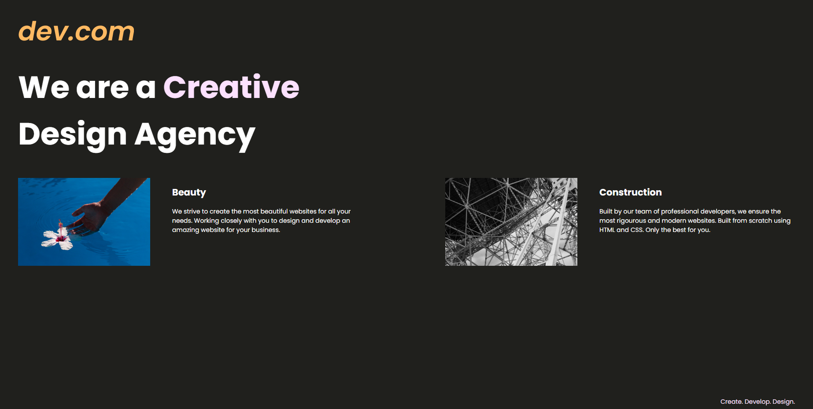

...

# WEB Design Agency Project / Media Query / App Brewery - Angela Yu Project

...

# A fully responsive EXAMPLE project written in HTML-CSS (Media Query) showing a agency website.

* This project is an example that was built along with a Udemy course showing how to create a responsive website in HTML-CSS. Every part of this project is sample code.

* In this project media query adjusts the size of the website according to the user's screen size.

## Take a look at the website.

